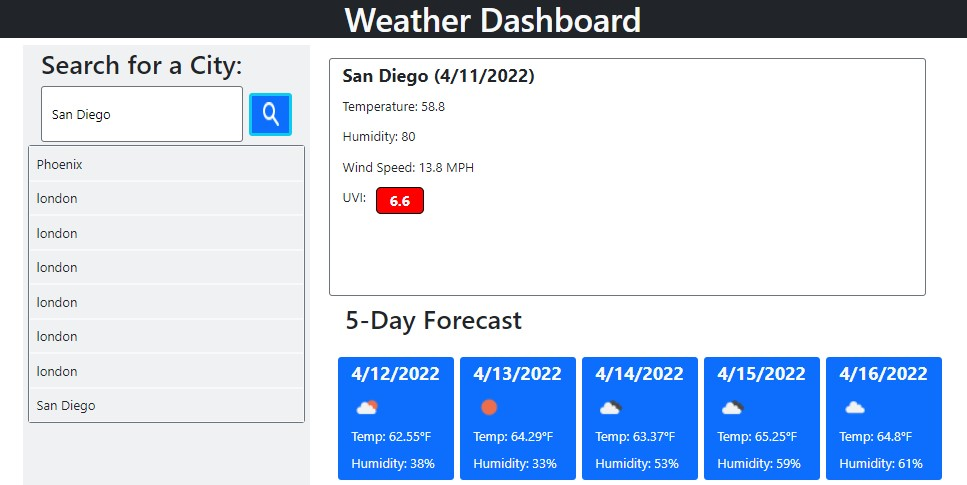

# Weather Dashboard

weather-dashboard

## Description 

This weather dashboard retrieves information from web databases using a server API then displays it for viewing.

## Table of Contents (Optional)

* [Installation](#installation)
* [Usage](#usage)
* [Final Product](#finalproduct)

## Installation

No installation is required; simply visit: https://blec333.github.io/weather-dashboard/ to review my deployed site.

## Usage 

To begin using this site after loading:

Simply type in the city name that you would like to view.

Click the button or press the enter key to begin the search.

Your search history will be saved on your local storage.

## Final Product

Deployed Application
https://blec333.github.io/weather-dashboard/

Github Repository
https://github.com/Blec333/weather-dashboard

### Acknowledgements

©Brennan LeClair
